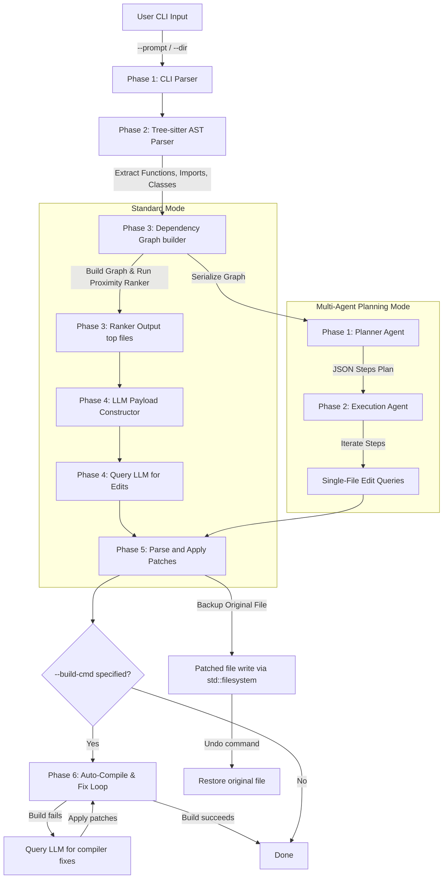

# 🛠️ Synapse - AI Coding Assistant CLI

A blazing-fast, terminal-native AI coding assistant built in C++17. `Synapse` reads your codebase structure, maps file relationships into a dependency graph, ranks relevant files using an AST-aware keyword & graph-proximity algorithm, and interacts with LLMs to automatically apply context-aware diffs with absolute safety (featuring automated in-memory backups and undo).

---

## ⚡ Technical Architecture & Code Flow

The execution workflow supports two distinct modes (Standard and Multi-Agent Planning) and features a compile verification loop:



### Module Breakdown

#### 📂 Phase 1: CLI Entry & Environment (`/cli/src/main.cpp`)
- Built using `cxxopts` to parse options.
- Initializes parameters: target codebase directory (`--dir`), prompt instruction (`--prompt`), and advanced modes:
  - `--divide`: Enables Multi-Agent Planning (Divide & Conquer) mode.
  - `--build-cmd`: Command to run to check compilation.
  - `--max-fixes`: Max iterations to fix errors (default: 3).

#### 📂 Phase 2: AST Analysis (`/cli/src/parser.cpp`)
- Traverses ASTs dynamically to extract functions, classes, and imports.

#### 📂 Phase 3: Graph Construction & Graph Ranking (`/cli/src/graph.cpp`)
- Generates dependency nodes, resolves imports to paths, and propagates weights.
- Supports **Graph Serialization** to provide a concise ASCII graph representation for the Planner Agent.

#### 📂 Phase 4: Network Payload & LLM Request (`/cli/src/client.cpp`)
- Communicates with the Gemini API to get raw edits, step-by-step plans, or compile fixes.

#### 📂 Phase 5: Diff Application & Safety (`/cli/src/patcher.cpp`)
- Parses SEARCH/REPLACE blocks and applies updates to files securely with automatic backup support (`.bak` files).

#### 📂 Phase 6: Auto-Compile & Fix Loop (`/cli/src/main.cpp`)
- Executes the user-provided compilation command after patches are applied.
- If compile fails, extracts offending source files from build logs and requests fix patches recursively from the LLM.

---

## 🛠️ How to Build (Windows)

We use **vcpkg** in **Manifest Mode** (`vcpkg.json`) to automate dependency installs, coupled with **CMake**.

### Prerequisites
- Windows 10/11
- Visual Studio Build Tools with C++ compiler and CMake support.

### Compilation Steps

1. **Bootstrap vcpkg**:
   Ensure `vcpkg.cmake` toolchain file path is known.

2. **Configure and Build**:
   Use CMake to configure and compile (e.g. using the Ninja or Visual Studio generator):
   ```powershell
   cmake -B build -S . -DCMAKE_TOOLCHAIN_FILE="C:/path/to/vcpkg/scripts/buildsystems/vcpkg.cmake"
   cmake --build build --config Release
   ```
   This generates `my_ai.exe` inside the build directory.

---

## 💻 CLI User Interface

```text
=========================================================
 🛠️  Synapse : AST-Guided Coding Assistant
=========================================================
Usage:
  my_ai.exe [OPTION...]

  -p, --prompt arg     User prompt for the AI (Required)
  -d, --dir arg        Target directory (default: .)
  -f, --file arg       Test AST parser on a specific file
  -u, --undo           Rollback the last applied changes
  -t, --top arg        Number of top relevant files to include in context
      --divide         Enable multi-agent planning (divide and conquer) mode
      --build-cmd arg  Compilation/build command to run for the fix loop
      --max-fixes arg  Max number of compiler fix iterations (default: 3)
  -h, --help           Print this help message
```

### Multi-Agent Planning & Fix Loop Output Example:

```text
=========================================================
 Scanning AST & Building dependency graph...
=========================================================
[✓] Dependency Graph built.

=========================================================
 Phase 1: Planner Agent (Divide & Conquer)
=========================================================
[~] Generating multi-agent plan with Gemini API...
[✓] Plan received from Planner Agent.

Proposed Steps:
  1. [src/database.h]: Modify saveUser signature to accept age.
  2. [src/user_service.cpp]: Update registerUser to pass age to saveUser.

=========================================================
 Phase 2: Execution Agent (Tiny Context Edits)
=========================================================
[Step 1 / 2] Modifying: src/database.h
[~] Fetching step suggestion from Gemini API...
[✓] Patched src/database.h successfully!

[Step 2 / 2] Modifying: src/user_service.cpp
[~] Fetching step suggestion from Gemini API...
[✓] Patched src/user_service.cpp successfully!

=========================================================
 Phase 6: Auto-Compile & Fix Loop
=========================================================
[~] Building project (Attempt 1 / 3):
Command: .\build.bat
---------------------------------------------------------
src/db_test.cpp(12): error C2660: 'Database::saveUser': function does not take 1 arguments
---------------------------------------------------------
Exit Code: 2
[!] Build failed. Requesting LLM correction...
[~] Requesting compiler error fixes from Gemini API...

[~] Applying compile fix patches...
[✓] Patched src/db_test.cpp successfully!

[~] Building project (Attempt 2 / 3):
Command: .\build.bat
---------------------------------------------------------
Build succeeded!
---------------------------------------------------------
Exit Code: 0
[✓] Build succeeded!
```
