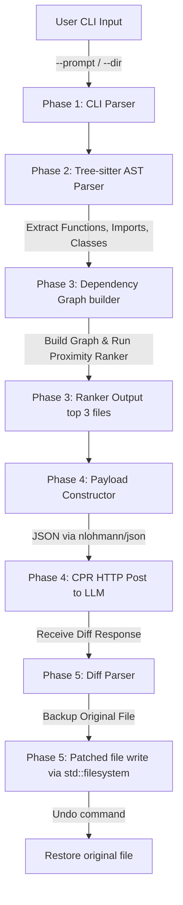

# 🛠️ my_ai - AI Coding Assistant CLI

A blazing-fast, terminal-native AI coding assistant built in C++17. `my_ai` reads your codebase structure, maps file relationships into a dependency graph, ranks the most relevant files using an AST-aware keyword & graph-proximity algorithm, and interacts with LLMs to automatically apply context-aware diffs with absolute safety (featuring automated in-memory backups and undo).

---

## ⚡ Technical Architecture & Code Flow

The execution workflow is segmented into five core stages, executing sequentially from parsing arguments to applying changes:



### Module Breakdown

#### 📂 Phase 1: CLI Entry & Environment (`/cli/src/main.cpp`)
- Built using `cxxopts` to parse options.
- Initializes environment parameters: target codebase directory (`--dir`) and prompt instruction (`--prompt`).
- Performs validation on input structures.

#### 📂 Phase 2: AST Analysis (`/cli/src/parser.cpp`)
- Loads `tree-sitter` and the appropriate language parser dynamically (e.g., Python, C++, JavaScript).
- Standardizes reading source files and traversing the AST (Abstract Syntax Tree).
- Pulls nodes of interest:
  - **Definitions**: Functions, classes, variable bindings.
  - **Imports/Includes**: Identifies references to external files (`import auth`, `#include "db.h"`).

#### 📂 Phase 3: Graph Construction & Graph Ranking (`/cli/src/graph.cpp`)
- Core structures:
  ```cpp
  struct Node {
      std::string filepath;
      std::vector<std::string> functions;
      std::vector<std::string> classes;
      std::vector<std::string> dependencies; // Extracted from imports
  };

  struct Edge {
      std::string source;
      std::string target;
  };
  ```
- **Graph Builder**: Populates a graph map (`std::unordered_map<std::string, std::shared_ptr<Node>>`). If file `A` imports `B`, a directed edge `A -> B` is added.
- **Ranker Algorithm**:
  1. Performs a fuzzy/keyword match between the user prompt and identifiers inside each node (e.g., searching for "auth" matches `auth_service.py`).
  2. Spreads weight outwards to neighbors: if `auth_service.py` is flagged, its parent imports and dependent modules are heavily weighted.
  3. Sorts and selects the top 3 files to build LLM context.

#### 📂 Phase 4: Network Payload & LLM Request (`/cli/src/client.cpp`)
- Constructs JSON structures utilizing `nlohmann-json`.
- Leverages `cpr` (C++ Requests, backed by libcurl) to execute asynchronous/synchronous REST requests.
- Securely sends payload using standard system environment variables (e.g., `GEMINI_API_KEY`).

#### 📂 Phase 5: Diff Application & Safety (`/cli/src/patcher.cpp`)
- Instructs the LLM to output precise Search-and-Replace Blocks.
- Parses blocks from the response.
- Creates an **in-memory backup** of target files before modifying.
- Modifies target files using `std::filesystem`.
- Offers a rollback system via `./my_ai --undo`.

---

## 🛠️ How to Build (Windows)

We use **vcpkg** in **Manifest Mode** (`vcpkg.json`) to automate dependency installs, coupled with **CMake**.

### Prerequisites
- Windows 10/11
- Visual Studio Build Tools (VS 2022) with:
  - **Desktop development with C++**
  - **C++ CMake tools for Windows**
  - **vcpkg package manager**

### Compilation Steps

1. **Bootstrap vcpkg** (if using standard Visual Studio-integrated vcpkg or your own clone):
   ```powershell
   # If you have vcpkg cloned locally:
   $VCPKG_ROOT = "C:/path/to/vcpkg"
   ```

2. **Configure with CMake**:
   Navigate to the `cli` directory and configure the project. CMake will automatically invoke vcpkg to pull down `cxxopts`, `cpr`, `nlohmann-json`, and `fmt`.
   ```powershell
   cmake -B build -S . -DCMAKE_TOOLCHAIN_FILE="$VCPKG_ROOT/scripts/buildsystems/vcpkg.cmake"
   ```

3. **Build the project**:
   ```powershell
   cmake --build build --config Release
   ```
   This generates `my_ai.exe` inside `build/Release/`.

---

## 💻 CLI User Interface

The command-line interface uses a sleek, high-contrast terminal theme with structured formatting:

```text
=========================================================
 🛠️  my_ai : AST-Guided Coding Assistant
=========================================================
Usage:
  my_ai.exe [OPTION...]

  -p, --prompt arg   User prompt for the AI (Required)
  -d, --dir arg      Target codebase directory (default: .)
  -u, --undo         Undo the last applied changes
  -h, --help         Print this help message

Example:
  ./my_ai --prompt "add validateEmail to registration flow" --dir ./src
```

### Output Flow Example:

```text
[~] Scanning AST & Parsing directory: ./src ...
[✓] Found 14 C++ files.
[~] Building dependency graph...
[~] Matching query "validateEmail" to AST identifiers...
    -> Match found in registration.cpp (Weight: 1.0)
    -> Spreading weights to neighbors (db_helper.cpp, auth.h)...
[!] Top 3 Context Files Selected:
    1. src/registration.cpp (Score: 1.00)
    2. src/auth.h           (Score: 0.50)
    3. src/db_helper.cpp     (Score: 0.25)

[~] Fetching suggestions from LLM...
[✓] AI suggests modification in src/registration.cpp.
[~] Backup created: src/registration.cpp.bak
[✓] Patched src/registration.cpp successfully!
    (Run './my_ai --undo' to restore)
```

---

## 🚀 Advanced Optimizations & Roadmap

To make `my_ai` compile, run, and scale faster than typical Python-based alternatives, we can implement the following enhancements:

### 1. Incremental AST Parsing & Caching
- **Problem**: Scanning hundreds of files on every execution takes time.
- **Solution**: We can hash the contents of files (e.g., using a quick MD5 or MurmurHash3) and serialize the AST output to a local SQLite database or JSON file. Next time `my_ai` runs, it will only parse files whose hashes have changed.
- **Tree-sitter feature**: Tree-sitter supports incremental parsing (re-parsing only modified lines).

### 2. Multi-threaded Parsing
- Walking the directory structure and parsing ASTs is highly parallelizable. We can use C++17 `std::execution::par` or thread pools to parse multiple files concurrently across all CPU cores.

### 3. Context Window Optimization (Token Pruning)
- LLMs charge by the token and slow down with huge prompts.
- Instead of sending the *entire* text of the top 3 files, `my_ai` can extract *only* the relevant class/function bodies using Tree-sitter coordinates, pruning unused helper functions and boilerplates to maximize instruction density.

### 4. Hybrid Graph + Vector Search
- Currently, ranking uses string matches on identifiers (variables, functions, imports) and spreads weights across graph edges.
- **Future**: We can integrate a small C++ embeddings library (like `llama.cpp` or vector quantization) to parse semantic intent (e.g., matching "verify user is logged in" to `check_auth_session`).

### 5. Multi-Language Extensibility
- Tree-sitter uses standard parser libraries written in C. We can support multi-language environments (Python, JS, Go, Rust, C++) by compiling their respective grammar files (`parser.c`) straight into our project or linking them dynamically.
